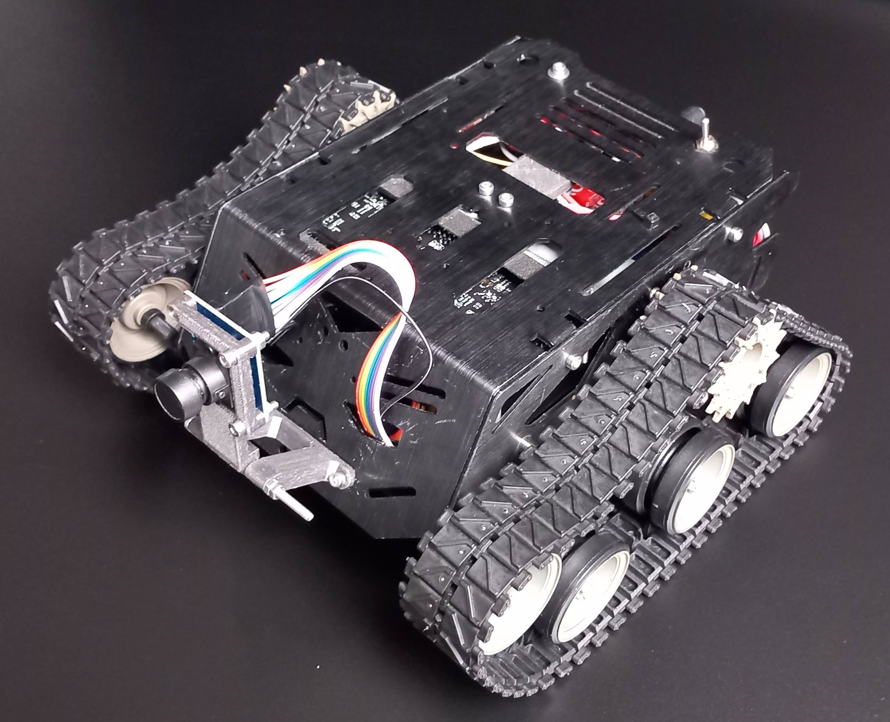
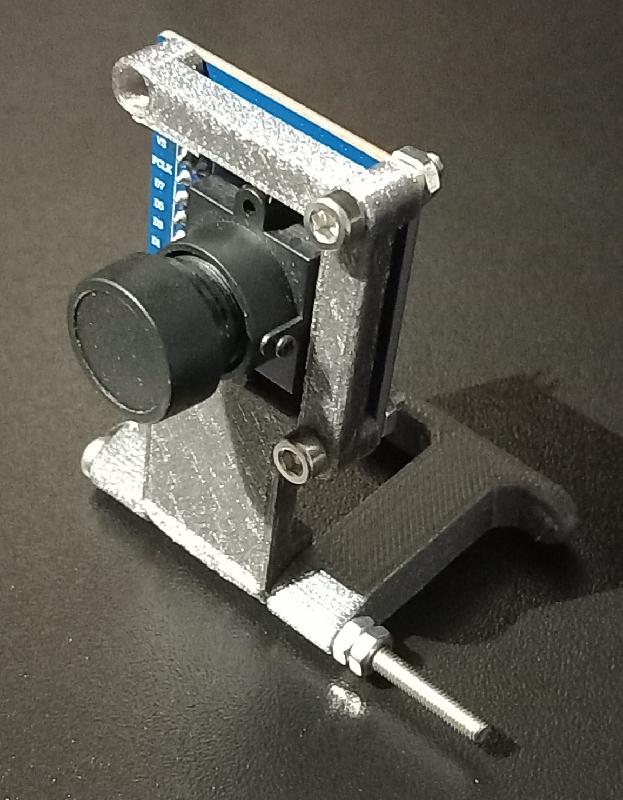
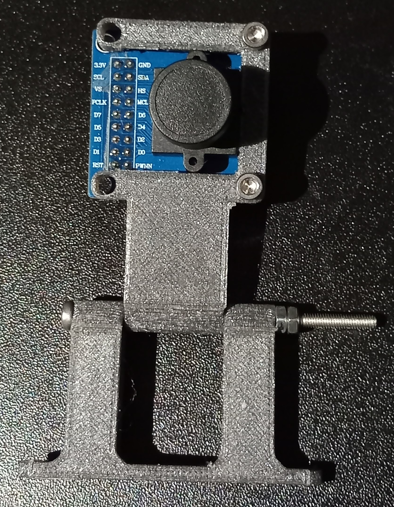
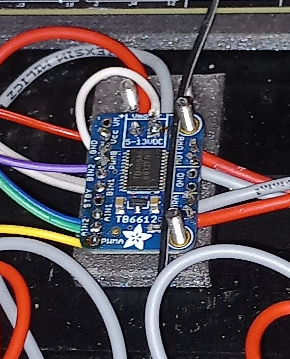

# Mobile robot tracking objects using image recognition

Final project for engineering degree. A mobile robot that tracks human faces in real time using live camera feed and machine learning image recognition. Based on an NXP [dm-multiple-face-detection-on-mcxn947](https://github.com/nxp-appcodehub/dm-multiple-face-detection-on-mcxn947) project.

  

## Hardware implementation

#### Boards:
- [FRDM-MCXN947](https://www.nxp.com/design/design-center/development-boards-and-designs/FRDM-MCXN947)
#### Toolchains and Technologies:
- Operating System: **Ubuntu 20.04 (Kernel 525.60.13)**
- Development Environments: **MCUXpresso IDE, Visual Studio Code, eIQ Portal 1.12.1**
- Machine Learning & AI Frameworks: **TensorFlow 2.15.1, YOLOv3**
- GPU Acceleration: **CUDA 12.2, cuDNN 8.9**
- Programming & Scripting: **Python 3.10.11**
- Design & Prototyping: **Figma**
#### Hardware Components:
- Camera: [Waveshare 9828](https://botland.com.pl/produkty-wycofane/4935-modul-kamery-ov7670-b-03mpx-640x480px-30fps-waveshare-9828-5904422300395.html)
- Motor Driver: Dual-channel [Adafruit 2448](https://botland.com.pl/sterowniki-silnikow-moduly/15916-tb6612-dwukanalowy-sterownik-silnikow-135v12a-ze-zlaczami-adafruit-2448-5904422324995.html) H-bridge module
- Motors: [DC motors](https://wagney.pl/produkt/17964-silnik-z-przekladnia-37dx68l-301-12v-330rpm-enkoder-cpr-64-zamiennik-pololu-4752/) for robot movement
- Chassis: [DFRobot Devastator](https://botland.com.pl/podwozia-robotow/3384-dfrobot-devastator-gasienicowe-podwozie-robota-z-napedem-6959420900541.html)
- Graphics Card: Gigabyte GeForce GTX 1050 (GPU acceleration for AI processing)

 
### Camera OV7670 + custom mount

  <table>
    <tr>
      <td align="center"> </td>
      <td align="center"> </td>
    </tr>
  </table>

### Dual-channel motor module Adafruit 2448

  

## Overview and wiring diagram

### OV7670 Module
Camera is connected to the <i>Camera Header</i> built into the development board.

  

### DC Motors
The motors are connected via an <i>H-bridge</i>, which has been configured and linked to the evaluation board using the **GPIO** interface and **cTimer**.

  

### External Power Supply
The board is powered by a set of six batteries, providing full autonomy to the robot. When the switch is turned to the ON position, the batteries begin supplying power to all system components.

  

# 

) 

